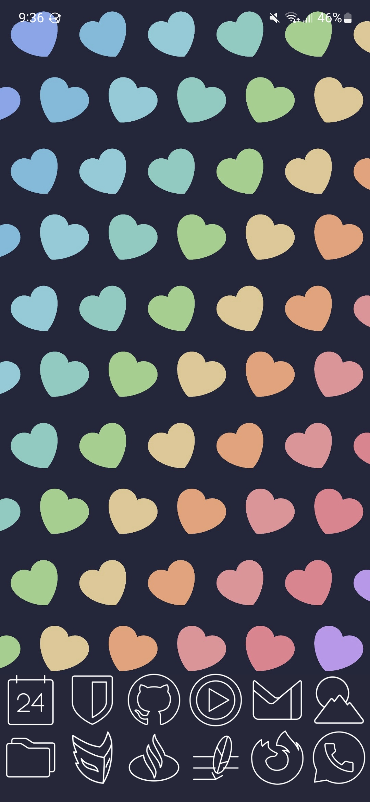
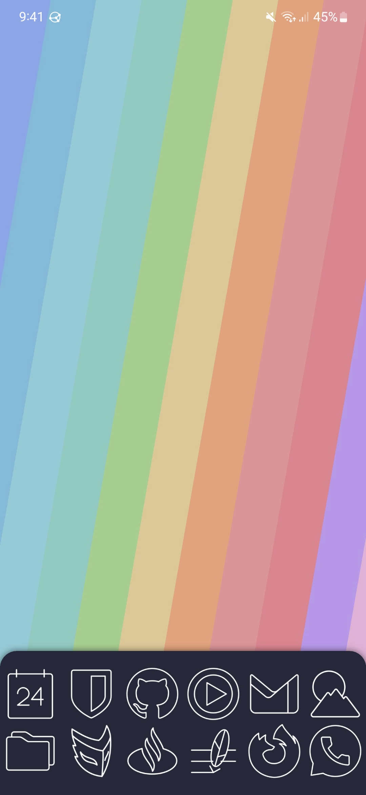

# Phone backgrounds

Testing creating backrounds for my phone with some basic html & css

To start up a server with live reloading: `bunx alive-server`

Take a screenshot of the screen element at a significantly higher resolution: `:screenshot --selector #screen --dpr 10`
